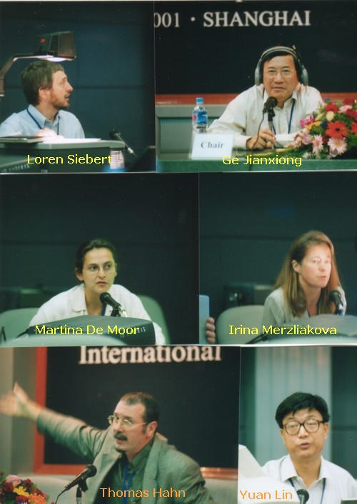

<strong>International Workshop on Historical GIS 

Fudan University, Shanghai, 2001</strong>

Organizers:

-- Jianxiong GE (Fudan University)
 -- Peter Bol</a> (Harvard University)
 -- Ruth Mostern</a> (U.C. Berkeley)
 -- Lex Berman</a> (Harvard University)

<strong>Day One :: Aug 23rd, 2001</strong>

 Creating a GIS Spatial History of Tokyo
 ---- <i>Loren Siebert [Univ of Akron] </i> <a href="../../work/docs/papers/Siebert-TokyoVisual.PDF" target="_new">Paper</a>
<p/ > 

 GIS Reporting of Population Distribution, from 1776-1953
 ---- <i>Jun Wang [Chinese Academy of Surveying and Mapping, Beijing] </i> <a href="../../work/docs/papers/wangjun.pdf" target="_new">Slides</a> - <a href="../../work/docs/papers/wangjun_short_gb2312.pdf" target="_new">Summary (Chinese)</a>

 A Rich Data Model for Historical GIS
 ---- <i>Brandon Plewe [Brigham Young Univ] </i> [no file provided]
<p/ > 

 County Boundaries in Historical GIS
 ---- <i>John Long [Newberry Library, Chicago]</i>
 <a href='../../work/docs/papers/JohnLong_shanghai.pdf'> pdf</a>    
<p/ >

 Solution to the Parent-Child Problem in Implementing a Dynamic Spatio-Temporal Database for the CHGIS Songjiang Data
 ----  <i> Lawrence Crissman and Lin Pu [Griffith Univ, Australia] </i> <a href='../../work/docs/papers/crissman_paper.pdf'>pdf </a>
<p/ > 

 An Historical-GIS for 200 years of Belgian Territorial Structures (1796-2000)
 ---- <i>Martine DeMoor [Ghent Univ]</i> <a href='../../work/docs/papers/demoor_shanghai.pdf'>pdf </a>    
<p/ > 

 Temporal GISes of changing administrative boundaries: European comparisons
 ---- <i>Ian Gregory [Lancaster Univ, UK]</i> <a href='../../work/docs/papers/Shanghai_gregory.pdf'>slides </a> - <a href='../../work/docs/papers/Shanghai_gregory_Text.pdf'>narrative </a>    
<p/ >

 English Historical Geography, Socio-Economic History and Historical GIS 
 ---- <i>Humphrey Southall [Univ Portsmouth, UK]</i> <a href='../../work/docs/papers/southall_shanghai.pdf'>pdf </a>    
<p/ > 

 Interoperability and Distributed GIS Models
 ---- <i>Ian Johnson [Univ Sydney, Australia]</i> <a href='../../work/docs/papers/johnson_shanghai_rev.pdf'>pdf </a>    
<p/ > 

 Digital Gazetteer Development 
 ---- <i>Ruth Mostern [Univ California, Merced]</i> <a href='../../work/docs/papers/mostern_shanghai.pdf'>pdf </a>    
<p/ > 

 Problems With Investigating Placenames in China's Northeast District During Pre-Modern Times 
 ---- <i>Yingsheng Liu [Nanjing University]</i> [no file provided]   
<p/ > 

 Integrating Contemporary Statistics into Historical GIS Context
 ---- <i>Shuming Bao [Univ Michigan]</i> <a href='../../work/docs/papers/bao_shanghai.pdf'>pdf </a>    
<p/ > 

 GIS Reconstruction of the "Daoist Grotto Heavens"
 ---- <i>Justin O'Jack [Univ California, Santa Barbara] 
</i> <a href='../../work/docs/papers/ojack_daoist.pdf'>pdf </a>    
<p/ > 

<strong>Day Two :: Aug 24th, 2001</strong>

 Monastic Census in GIS 
 ---- <i>Thomas Hahn [Cornell University]</i> [no file provided]   
<p/ > 

 Full Text Search System for Chinese Classics" on a Chinese Character Workstation 
 ---- <i>Lin Yuan [Shaanxi Teacher's College] </i> [no file provided]   
<p/ >

 Current Status of Building a Spatio-Temporal Infrastructure for Interdisciplinary Studies at Academia Sinica 
 ---- <i>I-chun Fan [Academia Sinica, Taipei] </i> [no file provided]  
<p/ >

 Development of China Historial GIS 
 ---- <i>Jianxiong Ge [Fudan University] </i> [no file provided]  
<p/ >

 Demostration of Qing (1820) CHGIS 
 ---- <i>Zhimin Man [Fudan University] </i> <a href='../../work/docs/papers/man_chgis_demo2001.pdf'>pdf </a>
<p/ >

 Chinese Rubbings Database 
 ---- <i>Ming Zhang [Beijing University] </i> [no file provided]  
<p/ >

 GIS Techniques for Cross-Time Analysis of China County Data
 ---- <i>Mark Henderson [Mills College]</i> <a href='../../work/docs/papers/henderson'> presentation </a>
- <a href='../../work/docs/papers/henderson_gloss_10Jan01.xls'>Glossary (xls)</a>      
<p/ > 

 China Historical GIS Version 1
 ---- <i>Merrick Lex Berman</i> <a href='../../work/docs/papers/lex_10aug01.pdf'>slides </a> - <a href='../../work/docs/papers/chgis_dbase_web_0806.pdf'>database design V1 </a>   
<p/ >

 A Mapserver for German Historical GIS
 ----  <i>Andreas Kunz [Inst for European History, Mainz]</i> <a href='../../work/docs/papers/Kunz-GIS.pdf'>pdf </a>    
<p/ >

 A History of Russian Administrative Boundaries (XVIII - XX centuries)
 ---- <i>Irina Merzliakova [Inst of Geography, Moscow] </i> <a href='../../work/docs/papers/merzliakova_shanghai.pdf'>slides </a> - <a href='../../work/docs/papers/karimov_merz.pdf'>narrative </a> 
<p/ >

 Examining Pre-Modern Vietnam With Historical GIS 
 ---- <i>Brian Zottoli [University of Michigan] </i> [no file provided]  
<p/ >

